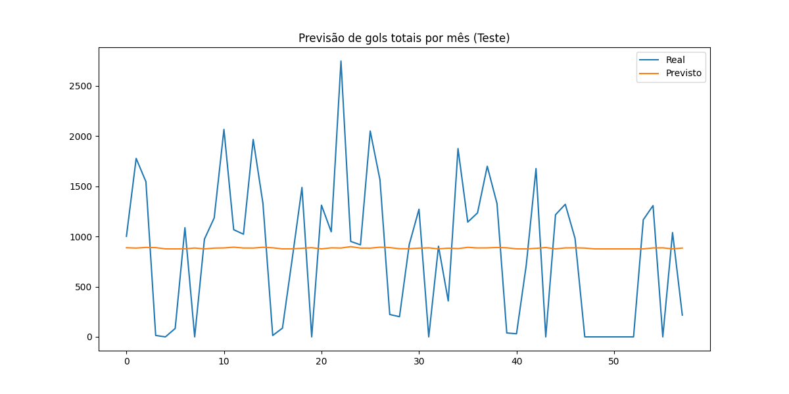

# Previsão de Séries Temporais no Futebol com RNN

## Visão Geral

Este projeto aplica técnicas de previsão de séries temporais a dados de partidas internacionais de futebol (1872–2017). Utilizando uma Rede Neural Recorrente (RNN) implementada manualmente em NumPy, o objetivo é prever estatísticas agregadas de partidas ao longo do tempo — especificamente, o total de gols por mês.

O projeto demonstra:

* Pré-processamento de séries temporais (engenharia de atributos, normalização, janelas deslizantes)
* Arquitetura RNN construída do zero
* Treinamento e avaliação com métricas como MAE e RMSE
* Visualização comparando valores reais e previstos

---

## Dataset

O dataset utilizado é o International Football Results disponível no [Kaggle / GitHub](https://github.com/martj42/international_results). Ele inclui todas as partidas internacionais de futebol registradas entre 1872 e 2017.

### lunas:

* `date` – Data da partida (YYYY-MM-DD)
* `home_team` – Nome do time mandante
* `away_team` – Nome do time visitante
* `home_score` – Número de gols do time mandante
* `away_score` – Número de gols do time visitante
* `tournament` – Nome do torneio (ex.: Amistoso, Copa do Mundo, Euro)
* `city` – Cidade onde a partida aconteceu
* `country` – País da partida
* `neutral` – Indica se o jogo foi em campo neutro (True/False)

### ansformação:

Para modelagem de séries temporais, o dataset foi agregado por mês, somando o total de gols em todas as partidas. Isso gera uma sequência numérica contínua adequada para previsão com RNN.

---

## Metodologia

1. Pré-processamento de Dados

   * Conversão de datas para formato datetime
   * Agregação mensal dos gols
   * Normalização dos valores com MinMaxScaler
   * Criação de janelas deslizantes de 12 meses passados para prever o mês seguinte

2. Arquitetura do Modelo (RNN)

   * Implementada do zero em NumPy
   * Atualização do estado oculto: `h_t = tanh(W_xh * x_t + W_hh * h_{t-1} + b_h)`
   * Predição da saída: `y_t = W_hy * h_t + b_y`
   * Treinamento usando Backpropagation Through Time (BPTT)

3. Métricas de Avaliação

   * MAE (Erro Absoluto Médio): mede a magnitude média do erro
   * RMSE (Raiz do Erro Quadrático Médio): penaliza mais fortemente erros grandes

---

## Resultados

* MAE (Treino): \~64 gols
* RMSE (Treino): \~69 gols
* MAE (Teste): \~133 gols
* RMSE (Teste): \~178 gols

### sualização

A figura abaixo compara os valores previstos e os reais do total de gols na base de teste:



A RNN captura as tendências gerais, mas tem dificuldades em prever picos extremos — uma limitação conhecida das RNNs simples sem mecanismos avançados como LSTMs/GRUs.

---

## Como Executar

1. Clone o repositório:

   ```bash
   git clone https://github.com/<seu-usuario>/football-time-series-rnn.git
   cd football-time-series-rnn
   ```

2. Abra o notebook Jupyter:

   ```bash
   jupyter notebook football_time_series_rnn.ipynb
   ```

3. Execute todas as células para:

   * Carregar e pré-processar o dataset
   * Treinar a RNN
   * Avaliar resultados e visualizar previsões


---

## Dataset

O dataset utilizado contém estatísticas detalhadas de partidas de futebol. Cada linha corresponde a uma partida e inclui informações como placar, posse de bola, cartões, passes, entre outros.

### Estrutura (head real do dataset)

```text
  country  league      home_team      away_team  home_score  away_score season_year date_day date_hour
0  England Premier     Arsenal        Chelsea    2           1          2024/2025   3.11     19:30
1  Spain   LaLiga      Real Madrid    Barcelona  1           1          2024/2025   3.11     17:30
2  Italy   Serie A     Milan          Inter      0           2          2024/2025   2.11     20:30
3  Germany Bundesliga  Bayern Munich  Dortmund   3           2          2024/2025   2.11     17:30
4  France  Ligue 1     PSG            Lyon       4           1          2024/2025   1.11     22:30
```

### Colunas Principais

* `country` – País onde a partida aconteceu
* `league` – Liga do jogo (ex.: Premier League, LaLiga)
* `home_team` – Nome do time mandante
* `away_team` – Nome do time visitante
* `home_score` – Gols do time mandante
* `away_score` – Gols do time visitante
* `season_year` – Temporada em que o jogo ocorreu
* `date_day` – Data do jogo (dia/mês)
* `date_hour` – Hora do jogo

> **Nota**: a data final utilizada no pré-processamento foi criada combinando `season_year`, `date_day` e `date_hour` em um `datetime` único.


---

## Trabalhos Futuros

* Substituir a RNN simples por LSTM ou GRU para melhor lidar com dependências de longo prazo
* Adicionar mais atributos (ex.: torneio, gols mandante/visitante separadamente)
* Utilizar frameworks modernos como PyTorch ou TensorFlow para maior escalabilidade
* Experimentar mecanismos de atenção para capturar padrões importantes

---

## Autor

Desenvolvido como parte de um trabalho de previsão de séries temporais. O projeto demonstra conceitos fundamentais de modelagem de sequências aplicados a estatísticas do futebol.

---

## Licença

Este projeto é distribuído sob a licença MIT. Veja [LICENSE](LICENSE) para mais detalhes.
